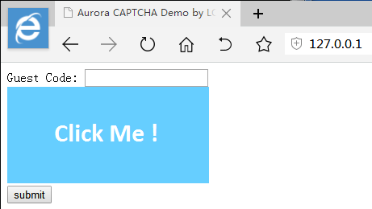
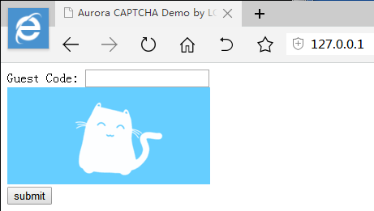
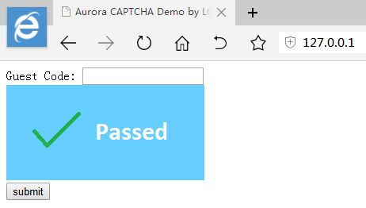

## 极光验证码

  极光验证码,使用工作量证明(PoW)算法解决人机识别问题.传统的验证码是使用图片/音频等人类可以识别的因素来区分机器与人类.使用工作量证明的意义在于,访问站点时,需要花时间来计算一些有难度的数据,再提交到服务器进行验证.在人类访问站点时,操作频率往往不会太高,这些数据比较快就能算出来.当机器人爬取站点数据或者做帐号密码爆破时,需要进行多次数据计算,导致机器人的CPU 占用变高,消耗其硬件资源


### 极光验证码Demo

  极光验证码无需用户输入任何数据,只需要点击图片即可
  
  Demo 程序路径是server.py ,运行之后访问地址`http://127.0.0.1/.`,在浏览器会看到这个界面
  
  
  
  点击图片验证码之后,浏览器会创建线程来执行大量的hash 计算
  
  
  
  计算结果完毕之后,提示验证通过
  
  
  
  Gif 演示动画
  
  
  
---
  
### 如何使用极光验证码(后端)
  
  目前Demo 版只支持Python Torando ,以后可能会移植到PHP 版本<br/>
  
  极光验证码的文件如下:
  
```python

    pow.py       工作量证明生成与验证逻辑
    captcha.py   验证码Tick 查询逻辑
```
  
  验证码的使用逻辑封装在`captcha.py` 里,只需要`import captcha` 即可使用.首先在tornado 里注册验证码需要用到的handle 
  
```python

    class get_captcha_handle(tornado.web.RequestHandler)     获取验证码
    class valid_captcha_handle(tornado.web.RequestHandler)   校验验证码
```
  
  示例代码:
  
```python

    handler = [
        ('/get_captcha',captcha.get_captcha_handle) ,  #  极光验证码CGI 
        ('/valid_captcha',captcha.valid_captcha_handle) ,
        ('/captcha/(.*)',tornado.web.StaticFileHandler,{'path':'captcha'}) ,  #  极光验证码静态文件
        ('/captcha_picture/(.*)',tornado.web.StaticFileHandler,{'path':'captcha_picture'}) ,
    ]
    http_server = tornado.web.Application(handlers = handler)
```
  
  至此,后端已经完成验证码模块的导入,我们还需要做的最后一件事是对用户上传的Tick2 进行验证,验证的接口在`captcha.py`
  
```python

    import captcha    #  导入极光验证码
    
    #  省略多余代码

    captcha.captcha.check_tick(tick_id)    #  只需要传递tick2 到check_tick() 函数即可得到验证码校验结果
```
  
  示例代码:
  
```python

    class login_handle(tornado.web.RequestHandler) :  #  server.py 的代码

        def post(self) :
            tick_id = self.get_argument('tick')  #  获取浏览器提交上来的Tick2
            valid_state = captcha.captcha.check_tick(tick_id)  #  验证Tick2 的结果

            if valid_state :  #  验证通过
                guest_code = self.get_argument('guest_code')

                if '514230' == guest_code :
                    result = 'Pass Success'
                else :
                    result = 'Pass Error'
            else :
                result = 'Captcha Error ..'

            self.write(json.dumps({
                'status' : result
            }))
```
  
  
### 如何使用极光验证码(前端)

  导入验证码模块和验证码UI 还在设计中,后面再更新
  
  当验证码计算完成并且获取到Tick2 时,会把Tick2 保存在全局变量`pass_tick` 中,在接下来和后端的校验中直接把Tick2 上传到服务器即可(Tick2 使用完毕之后会立即释放)
  
  示例代码:
  
```javascript

    function submit() {
        if (undefined == window.pass_tick) {  //  判断pass_tick 是否计算完成
            alert('Please Click CAPTCHA ..');

            return 'No Click Captcha';
        }

        guest_code = document.getElementById('guest_code');
        post_data = {
            'guest_code' : guest_code.value ,
            'tick'       : window.pass_tick  //  直接读取全局变量pass_tick 获取Tick2
        }

        check_state = request_post('/login',post_data);

        alert(check_state['status']);

        return check_state;
    }
```
  
---

## 极光验证码工作原理

  下图是极光验证码的工作原理,注意Tick1 和Tick2 的区别
  
  
  
  1.首先,浏览器加载到验证码,向服务器请求数据`/get_captcha` <br/>
  2.接下来,服务器随机生成工作量计算数据和Tick1,Tick1 的意义在于给工作任务定义一个唯一ID <br/>
  3.浏览器获取到工作量计算数据之后,进行大量的hash 计算,最后返回工作量计算到服务器验证计算工作`/valid_captha` <br/>
  4.然后,服务器对浏览器的工作量计算进行验证,并分配Tick2 ,Tick2 用于保存验证的结果<br/>
  5.最后,浏览器把需要验证/获取的数据加上Tick2 上传到服务器,让服务器对验证码和数据进行验证
  

### 极光验证码的工作量证明算法(Proof of Work)

  工作量证明是指系统为达到某目标而设置的工作度量方法,需要由工作者和验证者两方共同完成.
  
  1.工作者需要完成的工作必须有一定的量,这个量由验证者给出<br/>
  2.验证者可以迅速的检验工作量是否达标,注意这里的检验完成过程必须简单
  
  示例代码:
  
```python

    import hashlib
    
    def sha256(data) :
        return hashlib.sha256(data).digest()
    
    def valid(data = 'test',nonce = '000') :
        start_time = time.time()
        data = sha256(data)
        calcute = 0
        
        while not data.startswith(nonce) :
            data = sha256(data)
            calcute += 1
            
        end_time = time.time()
        
        return end_time - start_time,calcute
```
  
  这段代码的意义在于,不断地对data 进行sha256 运算,一直寻找以nonce 开头的hash 运算结果,运行这段代码,结果如下:
  
  
  
  结果显示,以'test' 为初始字符串不断进行sha256 运算,要找到'000' 未开头的hash 字符串需要用时16 秒,总计执行12118482 次计算过程
  
  那么服务器需要怎么样验证这个结果呢,方法很简单,获取最后hash 出来的结果的前一次hash 数据即可
  
```python

    import hashlib
    
    def sha256(data) :
        return hashlib.sha256(data).digest()
    
    def calculate(data = 'test',nonce = '000') :
        start_time = time.time()
        last_hash = data
        data = sha256(data)
        calcute = 0
        
        while not data.startswith(nonce) :
            last_hash = data
            data = sha256(data)
            calcute += 1
            
        end_time = time.time()
        
        return end_time - start_time,calcute,last_hash
        
    def valid_hash(hash_data,nonce = '000') :
        if sha256(hash_data).startswith(nonce) :
            return True
        
        return False
```
  
  校验结果如下:
  
  
  
  屏幕面前的你已经知道,这样是存在问题的,当黑客找到一条符合判断的hash 之后,`valid_hash()` 返回来的结果一定是True ,也就绕过了hash 计算,为了计算的结果足够随机,我使用了四要素
  
```
    string 字段      初始计算数据
    bit_flag 字段    目的hash 结果中要出现的标识
    bit_offset 字段  指定bit_flag 在hash 结果偏移bit_offset 个字节位置中出现
    hash_loop 字段   提交目的hash 结果的前hash_loop 次hash 结果
```
  
  计算逻辑如下:
  
  
  
  服务器能够很快地对客户端上传过来的结果进行校验
  
  
```python

    def valid_pow(pow_list) :  #  valid_pow() 的代码在pow.py 里
        try :
            for pow_index in pow_list :  #  注意这里有多个工作量证明的计算任务
                result_hash = pow_index['data']  #  读取客户端计算结果
                bit_flag = pow_index['bit_flag']
                bit_offset = pow_index['bit_offset']
                hash_loop = pow_index['hash_loop']

                for hash_index in range(hash_loop) :  #  对data 进行hash_loop 次sha256 运算
                    result_hash = sha256(result_hash)

                if not bit_flag == result_hash[ bit_offset : bit_offset + random_bit_flag_length ] :  #  判断hash 检验位
                    return False

            return True
        except :
            pass

        return False
```
  
  
### 极光验证码的Tick 逻辑
  
  既然没人看,那就偷个懒.略略略...
  
  
  